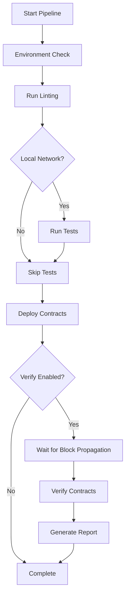

# 🚀 Eden Smart Contracts Deployment Pipeline

A comprehensive, automated deployment system with contract verification for Eden smart contracts.

## 🌟 Features

- **Automated Deployment**: Deploy multiple contracts with a single command
- **Contract Verification**: Automatic verification on Etherscan/Basescan
- **Multi-Network Support**: Deploy to Hardhat, Sepolia, Base, and Mainnet
- **Pre-deployment Checks**: Automated linting and testing
- **Error Handling**: Comprehensive error reporting and recovery
- **Deployment Tracking**: Track all deployed contracts and addresses

## 🚀 Quick Start

### Prerequisites

1. **Environment Setup**: Create a `.env` file with:
```bash
PRIVATE_KEY=your_private_key_here
RPC_API_KEY=your_rpc_api_key_here
ETHERSCAN_API_KEY=your_etherscan_api_key_here
BASESCAN_API_KEY=your_basescan_api_key_here
```

2. **Dependencies**: Install all required packages:
```bash
npm install
```

### 🎯 Basic Usage

#### Deploy to Local Hardhat Network
```bash
# Run full pipeline on local network
npm run deploy:pipeline

# Deploy specific module
npm run deploy:first-works
```

#### Deploy to Sepolia Testnet
```bash
# Full Sepolia deployment with verification
npm run deploy:pipeline:sepolia

# Sepolia-specific deployment script
npm run deploy:sepolia

# Deploy specific contract to Sepolia
npm run deploy:first-works:sepolia
```

#### Deploy to Mainnet
```bash
# Full mainnet deployment (use with caution!)
npm run deploy:pipeline:mainnet

# Deploy specific contract to mainnet
npm run deploy:first-works:mainnet
```

## 🔍 Contract Verification

### Automated Verification
Contracts are automatically verified during deployment on non-local networks.

### Manual Verification
```bash
# Verify all contracts from latest deployment
npm run verify:contracts:sepolia

# Verify specific contract
npm run verify:contracts:sepolia -- --address 0x1234...

# Verify contracts from specific module
npm run verify:contracts:sepolia -- --module FirstWorks
```

## 🛠 Advanced Usage

### Custom Deployment Pipeline

Create a custom deployment script:

```typescript
import { DeploymentPipeline, DeploymentConfig } from "./scripts/deploy-pipeline";

async function customDeploy() {
  const pipeline = new DeploymentPipeline("sepolia", true);
  
  const configs: DeploymentConfig[] = [
    {
      modulePath: "ignition/modules/FirstWorks/DeployAbrahamFirstWorks.ts",
      network: "sepolia",
      verifyContracts: true,
      environmentVars: {
        COLLECTION_NAME: "My Custom Collection",
        COLLECTION_SYMBOL: "MCC",
        MAX_SUPPLY: "1000",
        // ... other parameters
      }
    }
  ];

  await pipeline.deployPipeline(configs);
}
```

### Environment Variables Configuration

#### Required for All Networks
- `PRIVATE_KEY`: Private key of the deployer wallet

#### Required for Testnets/Mainnet
- `RPC_API_KEY`: API key for your RPC provider (AllThatNode, Alchemy, etc.)
- `ETHERSCAN_API_KEY`: For Ethereum networks verification
- `BASESCAN_API_KEY`: For Base networks verification

#### Optional
- `COINMARKETCAP_API_KEY`: For gas reporting
- `BASE_RPC_URL`: Custom Base RPC URL

## 📋 Available Deployment Modules

### 🎨 NFT Collections

#### Abraham First Works
- **Module**: `ignition/modules/FirstWorks/DeployAbrahamFirstWorks.ts`
- **Contracts**: `AbrahamFirstWorks.sol`, `FixedPriceSale.sol`
- **Features**: ERC721, EIP-2981 royalties, whitelist support

#### Abraham Early Works
- **Module**: `ignition/modules/NFT/DeployAbrahamEarlyWorks.ts`
- **Contract**: `AbrahamEarlyWorks.sol`
- **Features**: Limited supply NFT collection

#### Abraham Covenant
- **Module**: `ignition/modules/NFT/DeployAbrahamCovenant.ts`
- **Contract**: `AbrahamCovenant.sol`
- **Features**: Covenant-based NFT with special mechanics

## 🌐 Network Configurations

### Supported Networks

| Network | Chain ID | Explorer | Verification |
|---------|----------|----------|--------------|
| Hardhat | 31337 | Local | ❌ |
| Localhost | 31337 | Local | ❌ |
| Sepolia | 11155111 | Etherscan | ✅ |
| Base Sepolia | 84532 | Basescan | ✅ |
| Base | 8453 | Basescan | ✅ |
| Mainnet | 1 | Etherscan | ✅ |

### Network-Specific Commands

```bash
# Local development
npm run deploy:pipeline              # Hardhat network
npm test                            # Run tests first

# Testnets
npm run deploy:pipeline:sepolia     # Ethereum Sepolia
npm run deploy:pipeline:base-sepolia # Base Sepolia

# Mainnets (use with caution!)
npm run deploy:pipeline:mainnet     # Ethereum Mainnet
npm run deploy:pipeline:base        # Base Mainnet
```

## 🔧 Troubleshooting

### Common Issues

#### 1. Deployment Fails
```bash
❌ Error: insufficient funds for gas * price + value
```
**Solution**: Ensure your wallet has sufficient ETH for gas fees.

#### 2. Verification Fails
```bash
❌ Verification failed: Already Verified
```
**Solution**: Contract is already verified. This is not an error.

#### 3. RPC Issues
```bash
❌ Error: could not detect network
```
**Solution**: Check your `RPC_API_KEY` and network configuration.

#### 4. Environment Variables
```bash
❌ Missing required environment variables: PRIVATE_KEY
```
**Solution**: Ensure all required variables are set in your `.env` file.

### Debug Commands

```bash
# Check environment configuration
npx hardhat compile

# Test deployment on local network first
npm run deploy:pipeline

# Verify network connectivity
npx hardhat console --network sepolia
```

## 📊 Pipeline Flow



## 📁 File Structure

```
scripts/
├── deploy-pipeline.ts      # Main deployment pipeline
├── verify-contracts.ts     # Contract verification tool
├── deploy-sepolia.ts       # Sepolia-specific deployment
└── README.md

ignition/
├── modules/
│   ├── FirstWorks/         # Abraham First Works deployment
│   └── NFT/               # Other NFT deployments
└── deployments/           # Generated deployment artifacts
```

## 🎯 Best Practices

### Before Deployment
1. **Test Locally**: Always test on Hardhat network first
2. **Check Balances**: Ensure sufficient ETH for gas fees
3. **Review Code**: Run linting and ensure code quality
4. **Environment**: Verify all environment variables are set

### During Deployment
1. **Monitor**: Watch deployment logs for any issues
2. **Gas Prices**: Check gas prices on target network
3. **Confirmations**: Wait for sufficient block confirmations

### After Deployment
1. **Verify**: Ensure contracts are verified on block explorer
2. **Test**: Test contract functionality on testnet
3. **Document**: Save deployment addresses and transaction hashes
4. **Backup**: Keep secure backups of deployment artifacts

## 🔒 Security Considerations

- **Private Keys**: Never commit private keys to version control
- **Environment Files**: Add `.env` to `.gitignore`
- **Testnet First**: Always deploy to testnet before mainnet
- **Code Review**: Ensure all contracts are audited
- **Access Control**: Verify proper ownership and permissions

## 📞 Support

For issues or questions:
1. Check the troubleshooting section above
2. Review Hardhat Ignition documentation
3. Check network status and gas prices
4. Ensure all dependencies are up to date

---

*This deployment pipeline is designed to be robust, secure, and easy to use. Always test thoroughly before mainnet deployments!*